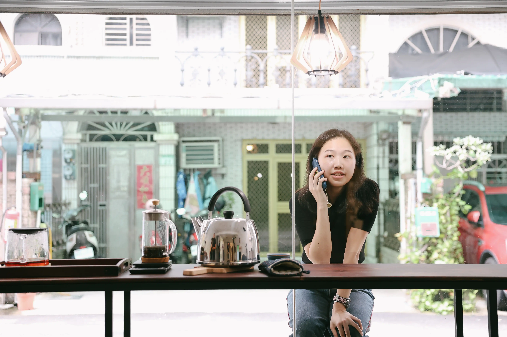

+++
date = '2026-04-05T00:15:59+11:00'
draft = false
title = 'About'
+++

LIN Pei-Yao was born in 1998 in Taichung, Taiwan. Using herself as an experimental subject, she primarily works with media, installation, and performance, capturing fleeting moments in everyday life in which subtle discrepancies arise between sensation and cognition, and probing the fluid, ever-changing space of perception. Through her work, she strives to create bodily experiences that are ambiguous and interwoven with reality and virtuality, while exploring the possibilities of bodily and mediated presence in relation to self-awareness and time perception.

E-mail: peiyao@protonmail.com

