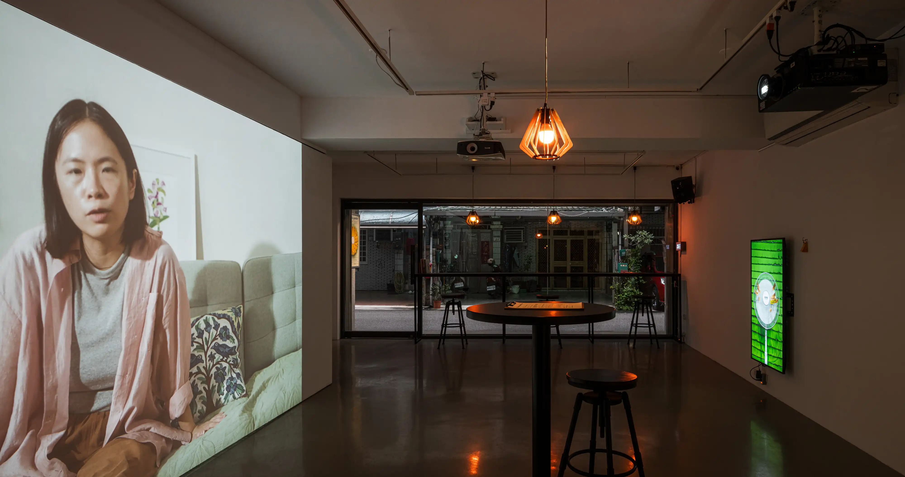

### About the Exhibition

When we speak, the voice resonates in the throat—but where does it reside when we think? Speaking is not merely an act of expression, but a dynamic process of perception: how does a voice emerge in the mind, and how is the self divided between speaking and listening?

Pei-Yao Lin’s solo exhibition *Who is the speaker?* invites viewers into the internal mechanism of speech, creating shifts in perception along the way. Voice and thought, speaking and listening, the inner and the outer—these dimensions overlap throughout the exhibition. The viewer’s body becomes both a vessel of perception and a site through which sound flows.

As words merge into thought and thought becomes word, an indistinct speaker quietly arrives—an invisible guest inhabiting the mind. And if they are willing, the viewer too may become a visitor of voice, drifting between focus and reverie, becoming, for a moment, the one who speaks.


2025-ZoneArt-16-0425.webp
2025-ZoneArt-28-1937.webp
2025-ZoneArt-1.webp
2025-ZoneArt-4.webp

*Inter-View with a Philosopher* (Three-channel audio spatial installation with video)


2025-ZoneArt-17-0538.webp
2025-speaker-3-0569.webp
2025-ZoneArt-19-0598.webp
2025-ZoneArt-23-0921.webp

*Who is the speaker?* Guided Tour Performance (speech-recognition interactive program, live performance, microphone, smart lighting, afternoon tea)  
Performed on Oct 26 opening reception


2025-ZoneArt-6.webp
2025-ZoneArt-5.webp
2025-PasFan-ZoneArt-3-1873.webp
2025-PasFan-ZoneArt-4-1805.webp

*Je suis pas fan* (single-channel video)
### Credits 
**Exhibition Team**  
Exhibition Visual Design: Sunnydance Co.  
Marketing Planning & Execution: Sydney Lee  
Exhibition Installation Design & Production: Sam Yong, William Hou  
Installation Assistance: Chien Li-Yun, Kuo Chia-Huang, Sam Yong, Kuo En-Shuo, Wilson WU  
Computer Environment Setup: Justin LIN, Wilson WU  

**Photo & Video Documentation**  
Exhibition View (Photo): dulub_studio  
Exhibition View (Video): Cheng Hsiang Yun, LIN Pei-Yao  
Video Documentation Editing: LIN Pei-Yao  
Opening Photo Documentation: Sun Yi-Ching  
Opening Video Documentation: Cheng Hsiang Yun  

**Sponsors & Co-organizers**  
Sponsor: National Culture and Arts Foundation  
Co-organizers: Zone Art, Taoyuan Department of Cultural Affairs  
