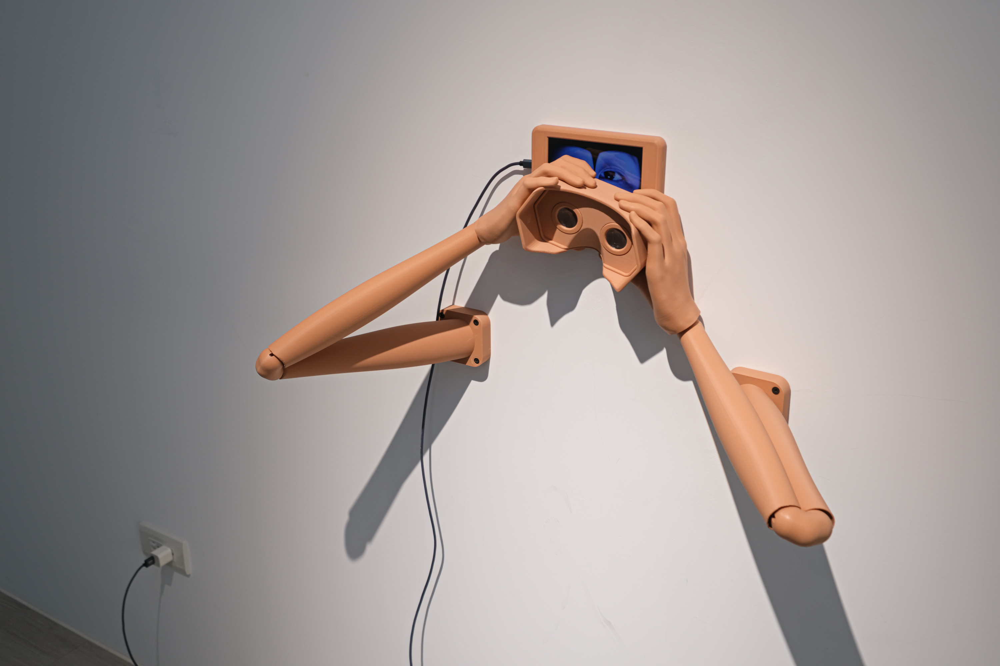

單頻道錄像、手機、3D列印互動裝置  
03’19”

「雙頻道（double-channel）」在描述錄像時是作為一個形容詞，已經不以複數型（double channels）的狀態存在。

手機中播放著一雙眼睛的影像，並邀請觀者進一步以簡易VR眼鏡觀賞。然而當使用VR眼鏡再度觀看手機時，看到的「一隻眼睛」，並不是現實中任一眼的360度影像，而是一隻由錯視造成、左右兩眼交疊而成的全新眼睛；而當看著這隻眼睛，其中倒映出的視野，也提供了觀者虛擬的鏡像。

我希望藉此提供一種分裂又合成的感知經驗，模糊對稱與複製、單數與複數間的相對關係。

### 2025《反覆演練Re-her-sal：觀眾入場》
軟輪畫廊，臺北，臺灣

2023-DChannel_I-eyes-11-202580A.webp
2023-DChannel_I-eyes-12-202580A.webp
2023-DChannel_I-eyes-14-202580A.webp
2023-DChannel_I-eyes-13-202580A.webp

### 2024《雙頻道》林沛瑤個展
洪建全基金會，臺北，臺灣

2023-DChannel_I-eyes-17-2024Hong.webp
2023-DChannel_I-eyes-18-2024Hong.webp
2023-DChannel_I-eyes-16-2024Hong.webp
2023-DChannel_I-eyes-15-2024Hong.webp

### 2024《自我測試開始》林沛瑤個展
金車文藝中心承德館，臺北，臺灣  

2023-DChannel_I-eyes-3-2024kingcar-61302.jpg
2023-DChannel_I-eyes-6-2024kingcar.jpg
2023-DChannel_I-eyes-7-2024kingcar.jpg
2023-DChannel_I-eyes-8-2024kingcar.jpg


### 〈雙頻道I：眼睛〉工作名單

概念發想與統籌｜林沛瑤  
手機影像拍攝與剪輯｜林沛瑤  
3D模型模特｜林沛瑤  
3D模型掃描｜吳奕蓁  
3D模型修模｜羅芷婕  
手臂組件設計製作｜羅芷婕  
