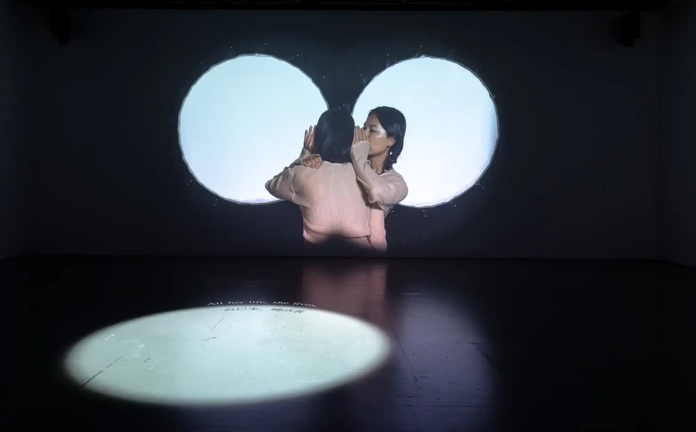

When we try to understand others, we can only empathize and imagine what others think or feel. So, does this process of putting “ourselves” in others’ shoes make others part of ourselves? When thinking about the self, we engage in the act of othering. Does this mean that the self is, in a way, an other?

We see others through ourselves and ourselves through others.

This work starts with one performer whispering a monologue. When the second performer joins, they reenact the first performer’s act together, creating an impression of mirroring each other’s solo performance. The work delves into different facets of self-awareness, such as what others might represent in our imagination, what we might appear in others’  imagination, and the image of “myself” that we envision.
### [Rehearsal for Re-her-sal: Preview](https://www.moca.taipei/tw/ExhibitionAndEvent/Info/%E5%8F%8D%E8%A6%86%E6%BC%94%E7%B7%B4Re-her-sal%EF%BC%9A%E9%A0%90%E6%BC%94?ref=peiyao.run)
Museum of Contemporary Art Taipei, Taipei, Taiwan  
Group exhibition, 2024
Curated by Chun-Lin Yen  




2024-DChannel2-3-moca.webp
2024-DChannel2-4-moca.webp
2024-DChannel2-5-moca.webp
2024-DChannel2-6-moca.webp



2024-DChannel2-7-moca.webp
2024-DChannel2-8-moca.webp
2024-DChannel2-9-moca.webp
2024-DChannel2-10-moca.webp



2024-DChannel2-11-moca.webp
2024-DChannel2-12-moca.webp
2024-DChannel2-13-moca.webp


**Openning Performance**  




2024-DChannel2-p1-moca.webp
2024-DChannel2-p2-moca.webp
2024-DChannel2-p3-moca.webp
2024-DChannel2-p4-moca.webp
2024-DChannel2-p5-moca.webp



2024-DChannel2-p6-moca.webp
2024-DChannel2-p7-moca.webp
2024-DChannel2-p8-moca.webp
2024-DChannel2-p9-moca.webp

Photo by Wang Shih-Yuan. Courtesy of Museum of Contemporary Art Taipei. 

### The Dual Double-Channel
HONG Foundation, Taipei, Taiwan
2024


2024-DChannel2-1-hong.webp
2024-DChannel2-2-hong.webp
2024-DChannel2-3-hong.webp



2024-DChannel2-4-hong.webp
2024-DChannel2-5-hong.webp
2024-DChannel2-6-hong.webp



2024-DChannel2-7-hong.webp
2024-DChannel2-8-hong.webp
2024-DChannel2-9-hong.webp

Photo by Chu Chi-Hung. 
### Credits
Director: LIN Pei-Yao  
Performers: Wei Peng, Aihsuan Chou  
Cinematography: KO LAIHE  
Art Design: LIN Pei-Yao  
Shooting Assistant: Yun-Rung Chu  
On-Site and Post-Production Sound Recording: Justin Lin  
Video Editing & Post-Production: LIN Pei-Yao  
Sound Design: Yuchin Chen  
Audio-Visual Software & Hardware Integration: Yuchin Chen  
Rehearsal Footage: Yun-Rung Chu  
 
