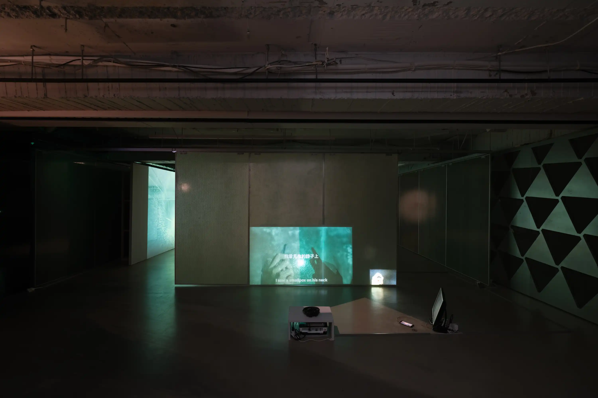

As an extension of the installation *[Run Into 100% Selves](/works/run-into-100percent-selves)*, the three-channel looping video connects different elements through the motif of the smartphone. A solo monologue transforms into a dialogue between different versions of the self: me, my image, my shadow, and my smartphone—perhaps even the person on the other end of the phone?

---
### 2024 [The Dual Double-Channel](/exhibitions/2024-the-dual-double-channel)
HONG Foundation, Taipei, Taiwan


2024-projectseek-5-60205.webp
2024-projectseek-6-55739.webp
2024-projectseek-3-41135.webp
2024-projectseek-7-43030.webp


---
### 2021 [Run Into My-Cell](/exhibitions/2021-run-into-my-cell)
Na-Pei Gallery, Taipei National University of the Arts, Taipei, Taiwan


2021-gaze triangle_1.webp
2021-gaze triangle_4.webp
2021-gaze triangle_3.webp
2021-gaze triangle_2.webp


---


---
### Credits
Performer: LIN Pei-Yao  
Multi-Channel Video Synchronization: [Justin Lin](https://wancat.cc/)
