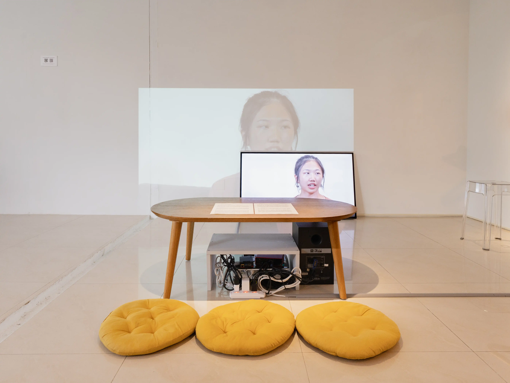

---
categories:
date: 2025-03-06T12:28:37+08:00
description: When watching interview videos without subtitles, I often find myself lost in the expressions and body language of the speakers, occasionally missing parts of their speech.
draft: false
image: /ghost-images/2025/03/_NZ_003.webp
slug: interviewwithanartist
tags:
title: Inter-View with An Artist
---
*A pilot work for Inter-View with a Philosopher*

interview footage from Re-her-sal: Preview  
07’49”  

When watching interview videos without subtitles, I often find myself lost in the expressions and body language of the speakers, occasionally missing parts of their speech. Interestingly, these interviews not only exclude the interviewer from the frame but also remove their questions, leaving the interviewee seemingly speaking to themselves.

When only the answers remain, what were the questions?  


2025-80Agallery-15.webp
2025-80Agallery-12.webp
2025-80Agallery-14.webp
2025-80Agallery-13.webp
2025-80Agallery-2.webp


This is an experiment using an interview video from a previous exhibition. The next interviewee will be a philosopher.


### Rehearsal for Re-her-sal: Entering the Auditorium
Feb 06 - Mar 01, 2025 
80A Gallery, Taipei, Taiwan  
Curator: Chun-Lin Yen  
Artist: Shiou-Fen Li, Tsong-Tãi Gôo, Pei-Yao Lin, Man-Chun Chao, Pei-Yi Lin, Hao-Yuan Chang    
### Credits
Editing & Audio Mixing: Pei-Yao Lin  
Programming: Justin Lin  

**Interview Materials**  
Exhibition: Rehearsal for Re-her-sal: Preview  
Curator: Chun-Lin Yen  
Interviewer: Chun-Lin Yen  
Videographer: I-Shun Chen

**Exhibition Documentation**  
Photography: Chih-Fan Tsai  
Video Documentation: I-Shun Chen
Editing: Pei-Yao Lin  
