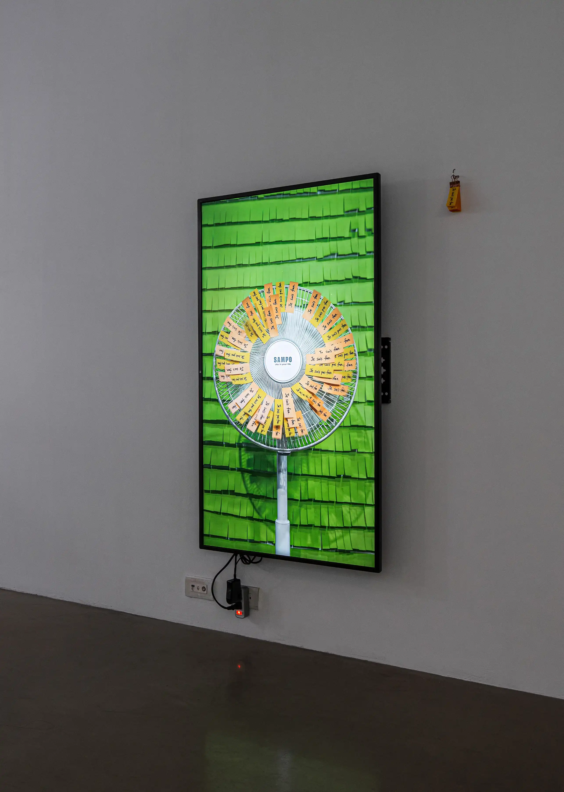

一支電扇吹拂黏貼其上的便利貼，不同顏色的便利貼寫著不同的句子，分別是法文“Je suis fan.”（我是粉絲／我喜歡）與“Je suis pas fan.”（我不是粉絲／我不喜歡）；當便利貼被風吹落，耳邊將響起相對應的句子，以中文輕聲念出的「我喜歡」或「我不喜歡」。

“Fan” 同時具備「風扇」與「粉絲」的雙重意涵，便利貼的隨機掉落則借用了法國傳統遊戲「effeuiller la marguerite」（他愛我／他不愛我），即透過一瓣瓣摘取雛菊花瓣來猜測愛慕對象的心意。 透過玩味多重的語言遊戲，電扇化身為花朵，將他人對自己的情感（他愛不愛我）翻轉為自身的偏好（我喜歡與否），並同時展開自身的存在主義探問（我是／我不是電扇）。因此，電扇以嬉戲的姿態在遊戲中辯證的，除了關於愛，也是關於自我的哲學問題。


2025-Philosopher-ZoneArt-8.webp
2025-Philosopher-ZoneArt-10.webp

### *Who is the speaker?* 林沛瑤個展
2025.10.22-2025.11.19  
众藝術，桃園，臺灣  
(*看更多展覽紀錄*)