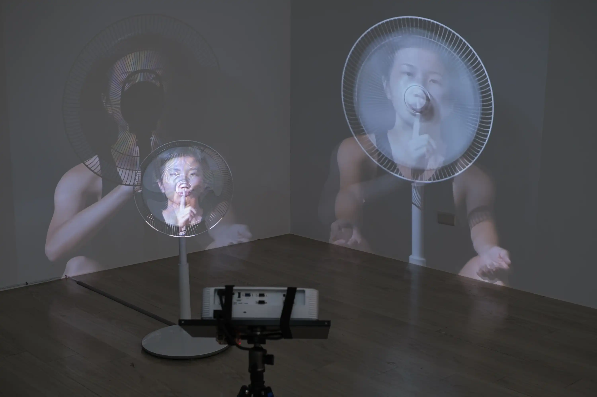

In the silence of the whisper of the wind, thoughts serve as both talking and listening. I've gathered some fragments of time perception via consciousness, attempting to manifest them in the circulating fan blades, the transparency in various states of visibility, and the flowing air.

Mind-blowing implies something extremely exciting or surprising, literally presenting something that "blows the mind" or a mind being blown. Besides the flow of consciousness caused by external changes, there are also words long-buried within the body emerging, flashing through the mind. The “sound” is both familiar and alien, like oneself from long ago.

This is a theater of interaction between oneself and one's own body, playing between the everyday and the dramatic. When alone in one's own consciousness, is it the mind blowing, or is it the mind being blown? As one stares at the continuously moving fan long enough, the wind blows, perhaps occasionally speaking to you as well. Consciousness flows, between the movement of the wind and the movement of the mind.  

Hello, friend. Talk to me. Listen to me. In this era, everyone speaks alone to the countless absent others.

---
### 2024 *Self-Testing Starts*
King Car Cultural & Art Center, Taipei, Taiwan    

2023-mindblowing-2024kingcar-1.webp
2023-mindblowing-2024kingcar-4.webp
2023-mindblowing-2024kingcar-5.webp



2023-mindblowing-2024kingcar-6.webp
2023-mindblowing-2024kingcar-7.webp
2023-mindblowing-2024kingcar-8.webp



2023-mindblowing-2024kingcar-10.webp
2023-mindblowing-2024kingcar-9.webp
2023-mindblowing-2024kingcar-11.webp

Photo by Chu Chi-Hung. 

---
### 2024 Kaohsiung Award
Kaohsiung Museum of Fine Arts, Kaohsiung, Taiwan

P0097718.webp
P0097697.webp
P0097711.webp

Photo by Studio Millspace. Courtesy of Kaohsiung Museum of Fine Arts.


Filmed by KO LAIHE. Edited by LIN Pei-Yao.

---
### Credits
Writer, Director, Performer & Editor: LIN Pei-Yao  
Cinematography: KO LAIHE  
3D model scanning: WU Yi-Jhen  
3D scanning clip shooting: SHIH Li-Jia  
