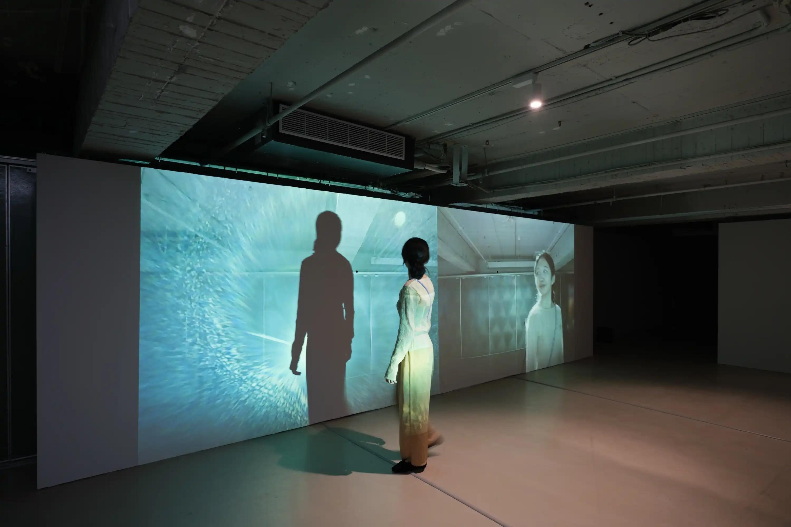

在一個對稱的類鏡像空間中，身體的影子與影像共構了一組不共時的投影平面。不管從哪一側進入，觀者將像遇見他人一般，遇見自己的影像。

來自過去的延遲影像朝自己走來，同時觀者的剪影則與身體同步，朝著延遲影像走去。實時的影子與延遲的影像將於此空間中央相遇、交會、融合、短暫消失再分離。兩種時間性在特定時空下交會，分離開來後又各自回到原狀。

在當代的人我互動中，自我與他者的界線逐漸模糊；我們經由中介遇見他者，又或者我們遇見的，也全是自身的倒映。

來遇見100%的自己。

---
### 2024 雙頻道
洪建全基金會，臺北，臺灣  


2024-projectseek-10-44252.webp
2024-projectseek-8-42015.webp
2024-projectseek-9-44245.webp
2024-projectseek-11-44513.webp
2024-projectseek-13-44702.webp
2024-projectseek-14-44802.webp

攝影：朱淇宏

---
### 2022 漂亮的很好：北藝大美術學系碩士班級展
地下美術館，國立臺北藝術大學，臺北，臺灣


/ghost-images/2022/08/220331170034-mini-sRGB--.webp
/ghost-images/2022/08/220331170008-mini-sRGB--.webp
/ghost-images/2022/08/220331170019-mini-sRGB--.webp
/ghost-images/2022/08/220331170302-mini-sRGB--.webp
/ghost-images/2022/08/220331171856-mini-sRGB--.webp
/ghost-images/2022/08/220331170356-mini-sRGB--.webp

攝影：朱淇宏  

---
### 2021 遇見100%的我自己（Run Into My-Cell)
南北畫廊，國立臺北藝術大學，臺北，臺灣


2021-runinto100selves-2021tnua-2.webp
2021-runinto100selves-2021tnua-4.webp
2021-runinto100selves-2021tnua-6.webp
2021-runinto100selves-2021tnua-7.webp
2021-runinto100selves-2021tnua-8.webp
2021-runinto100selves-2021tnua-9.webp
2021-runinto100selves-2021tnua-10.webp

攝影：朱淇宏 

---

2024／2021 展出紀錄（拍攝：高來河／剪輯：林沛瑤）

---
### Credits
**2024**  
自啟動程式設計｜林宏信  
佈展協力｜楊健生 吳奕蓁 王楹凱

**2022**  
木作設計｜楊健生  
佈展協力｜楊健生 柯幸均 郭恩碩  

**2021**  
佈展協力｜蔣雅媛