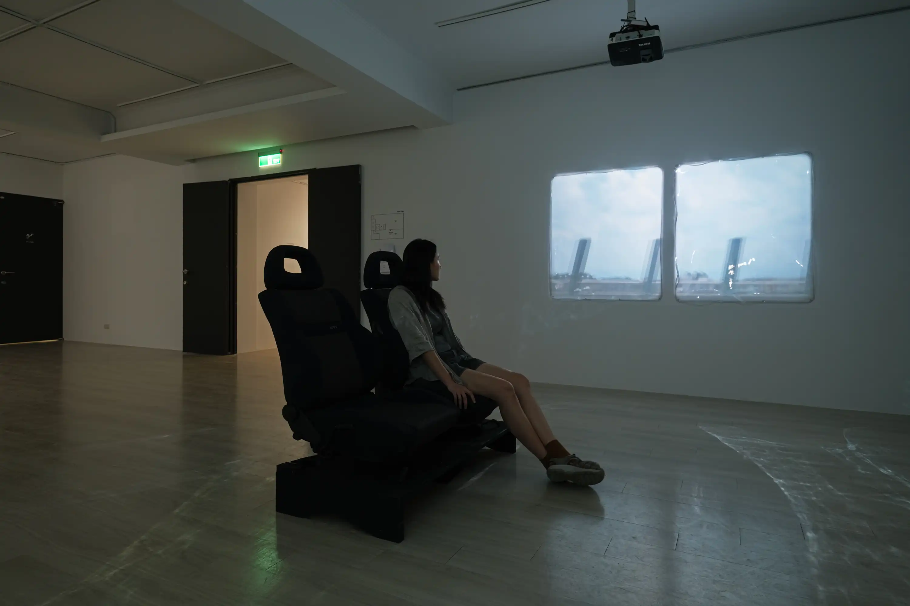
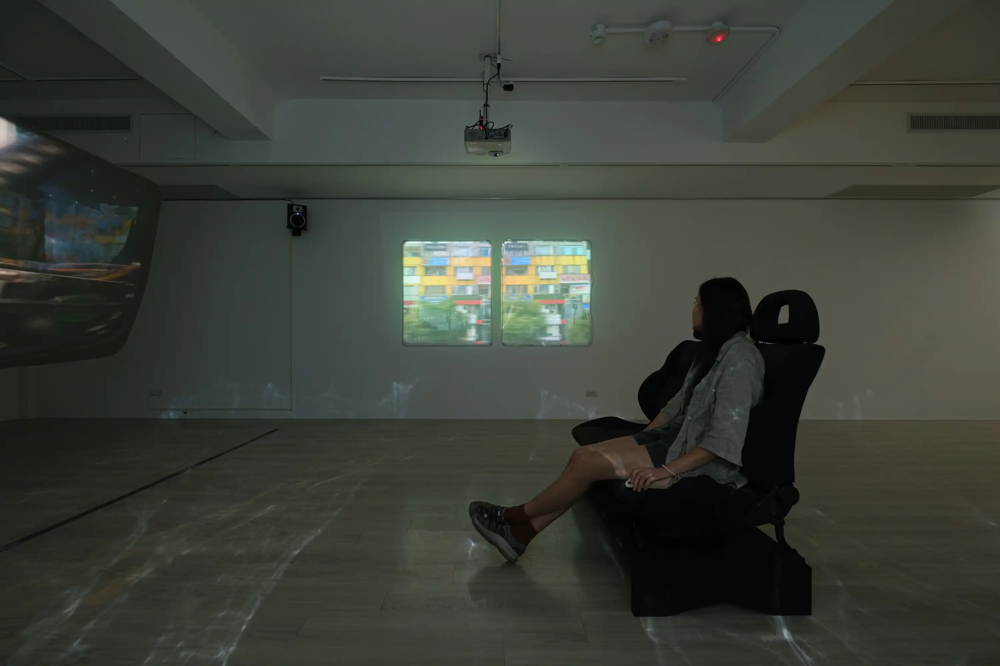

兩個事件，一個故事。

(1) 在隨意拍攝公路旅途的某日，我偶然發現兩種不同的間距，在不同的速度下重疊所產生的景觀。在時速百米的高速狀態下，肉眼觀看的分隔島圓柱會產生視覺暫留；然而在與車速恰好配合的狀態下，攝影機快門的時間間距，與柱子間的空間間距形成新的序列，在某些時間點上完全重合，使得圓柱停滯、傾斜、旋轉、甚至向前跑，就像在跳舞一般。

(2) 列車的車窗將景象切割成序列，動態影像也由照片的序列所構成。有時我會想：在間距中——我感知所不及之處——發生了什麼事？窗戶與窗戶之間實際上經過了多少空間、多少時間？

(3) 我們自動用想像填補了間距。如果其實——在間距之中，時空經歷了摺曲或任何形式的變化——那世界就與我們想像得完全不一樣。科幻，或許就在日常生活之中。

---
### 2024 自我測試開始
金車文藝中心承德館，臺北，臺灣  


2024-setInterval-8-64514.webp
2024-setInterval-9-65335.webp
2024-setInterval-7-62933.webp
2024-setInterval-11.webp



2024-setInterval-4-64430.webp
2024-setInterval-6.webp
2024-setInterval-4-64430.webp
2024-setInterval-1-62812.webp

攝影：朱淇宏

---

拍攝：高來河／剪輯：林沛瑤

---
### Credits
汽車座椅底座設計｜楊健生  
投影膜裱貼｜吳奕蓁、楊健生  