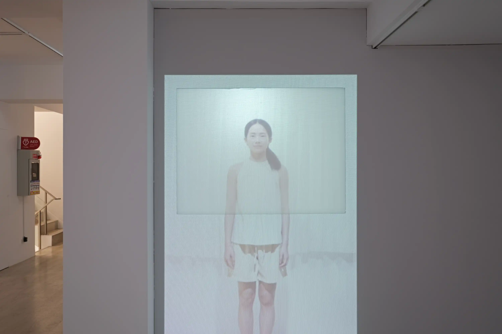

影像是一層薄紗。  
一直以來，我思考著如何使用單個頻道的影像，給予觀者複數軸線的時間感知。

他成為了一個雙面人或雙背人，同時在窗內又在窗外；而當他隱沒入窗簾後頭，則既不在內也不在外。  
他所應該在的位置，透過想像形成了向內凹折的負空間：一個「nowhere」、一個不存在的地方、影像的「厚度」之中。

同時在內與外，或同時不在內也不在外。  
不存在背面的正面，與不存在正面的背面。  
離開的同時，沒有前往任何地方。  

---
### 2024 自我測試開始
金車文藝中心承德館，臺北，臺灣  


2022-twofaced-2024kingcar-1.webp
2022-twofaced-2024kingcar-3.webp
2022-twofaced-2024kingcar-4.webp
2022-twofaced-2024kingcar-5.webp



2022-twofaced-2024kingcar-6.webp
2022-twofaced-2024kingcar-8.webp
2022-twofaced-2024kingcar-9.webp

### 2022 地下美術館
國立臺北藝術大學，臺北，臺灣

2022-Two-faced-8.webp
2022-Two-faced-9.webp
2022-Two-faced-b.webp
2022-Two-faced-1.webp
2022-Two-faced-3.webp


---

拍攝：高來河／剪輯：林沛瑤

---
### Credits
**錄像拍攝**  
演出｜王薪語  
拍攝與剪輯｜林沛瑤  
拍攝協助｜施力嘉  
佈景搭設協力｜吳奕蓁 簡莉芸  

**2024展覽**  
木作｜楊健生 劉昱廷 左晉文 邱育昇  
布展協力｜吳奕蓁 徐銘謙 簡莉芸

**2022展覽**  
木作｜楊健生 劉昱廷  
布展協力｜吳奕蓁 徐銘謙    