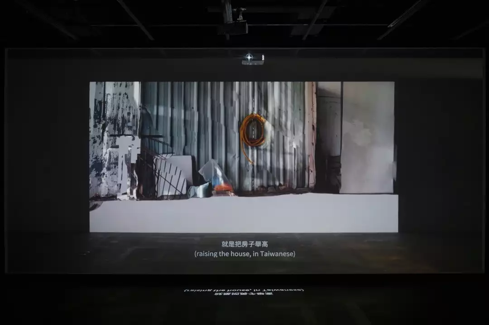
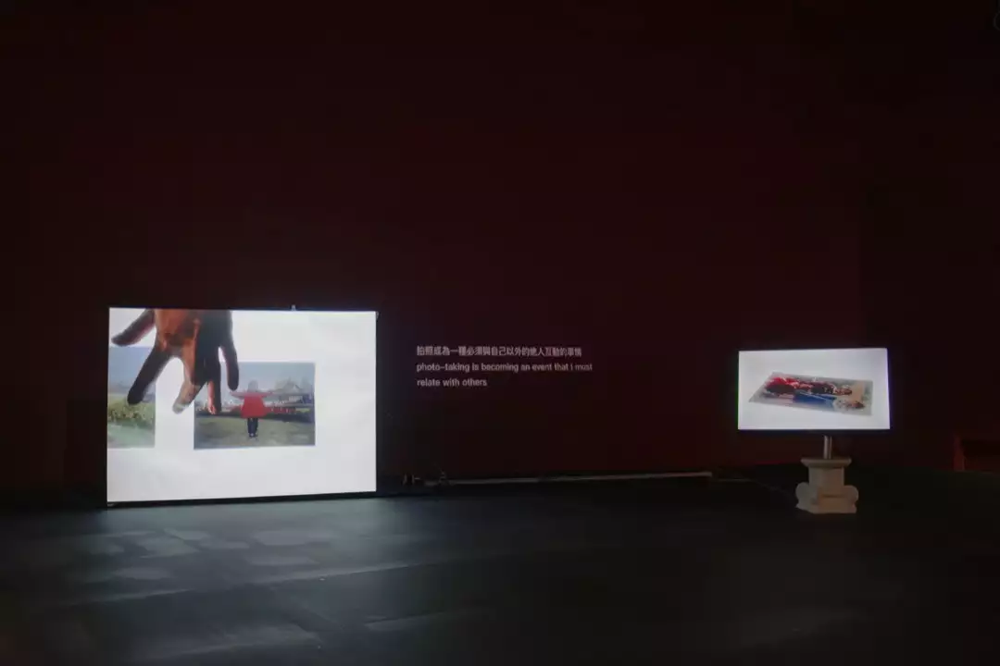
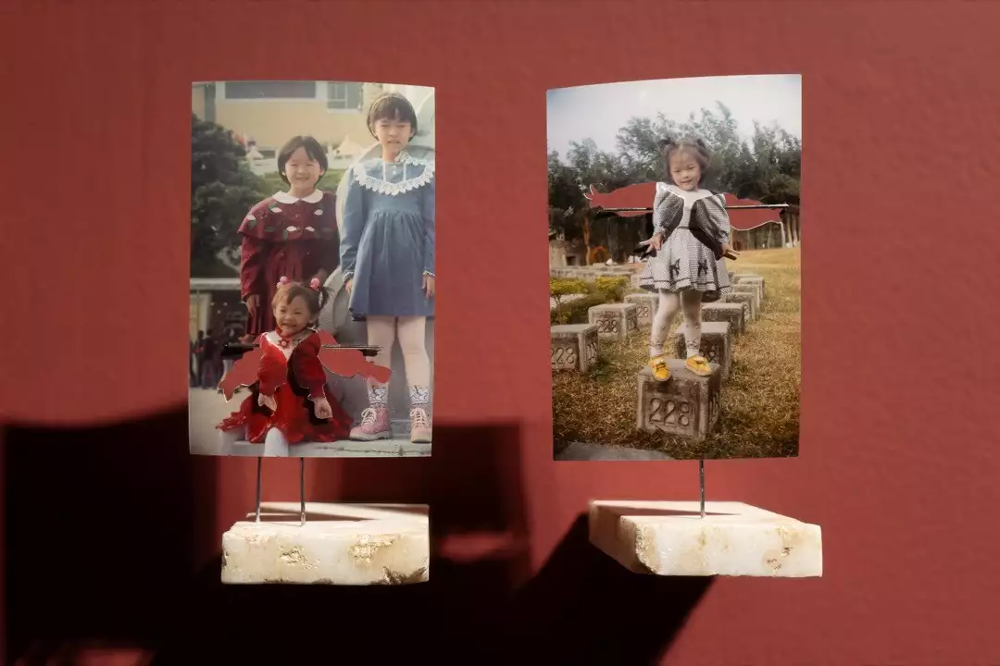
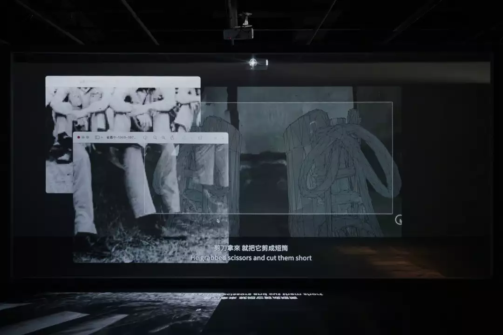
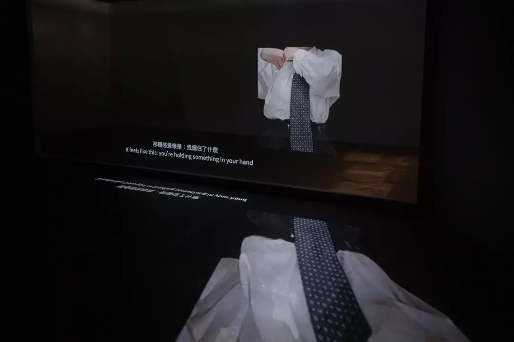
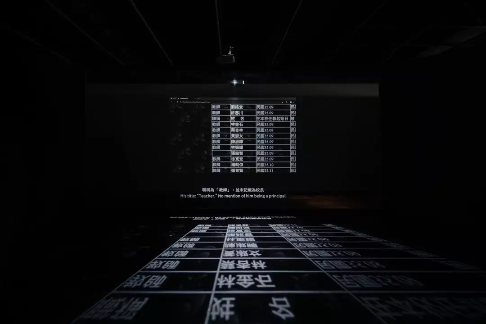
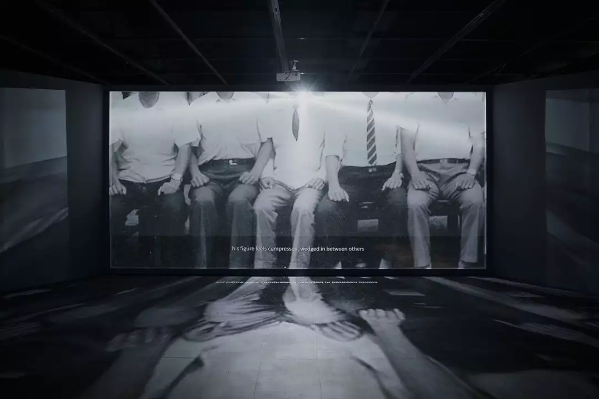
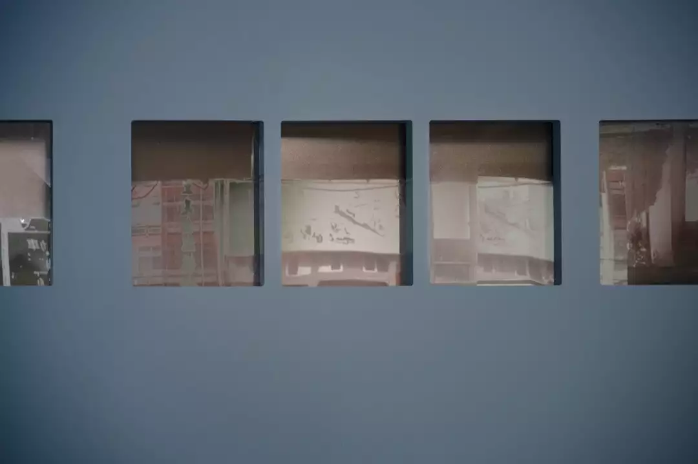
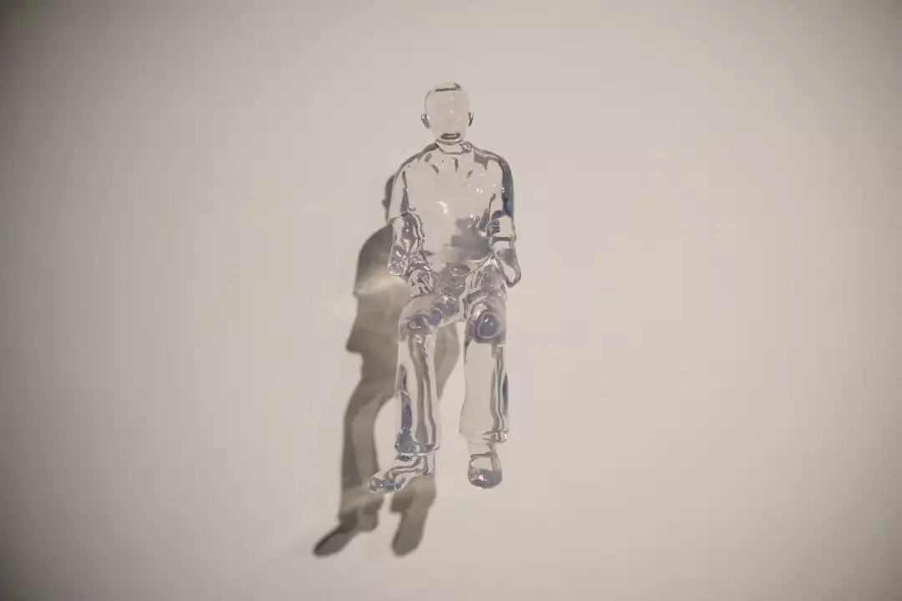

一場訪談或是一部紀錄片，讓人最難以置信的，時常不是導演實際上拍下了什麼、影像內發生了什麼事，而是一個更為直接的疑問：這些究竟是用什麼方式、在什麼情境下被記錄下來的？

一件非虛構作品最吸引人的，常常是記錄者與被記錄者之間的關係。尤其當兩者之間還有著其他緊密的身份羈絆，纏繞、疊加在記錄的關係之上，像是朋友、師生、情人或家人。鬆動鏡頭意識的往往是奠基於關係的情感，與攝影機原生的侵略性相互衝突，進而使距離感產生變化。

話雖如此，張庭甄的作品幾乎沒有以攝影機直接拍攝人物對象。展覽同名作品《藍門後的光》（2025）以其對檔案——包含家人的老照片、3D掃描模型、訪談父親的音檔——的反覆操作與玩轉，以及可視卻不可觸及、步入的雙層投影空間，為觀眾創造出有別於一般紀錄片觀看的獨特身體感。

#### 接觸檔案的身體感

《藍門後的光》從舊家屋3D掃描模型的畫面開始，因為現場的光線不足，模型顯得有些殘破。影像以無重力的視角，帶領觀者徜徉於藍色門扇後，耳畔同時響起藝術家父親的聲音，舊地重遊般地介紹祖父的舊家屋。

這是父親長大的房子，即將轉售他人，而掃描記錄下來的是交屋的前一天。從家屋的歷史沿革開始娓娓道來，父親敘述著小時候家裡的舊格局、空地曾種植的果樹，再到因道路拓寬徵收而必須調整房屋格局的「舉厝」(1)過程。有趣的是，已化為模型的屋子，在影像中能夠被藝術家輕易地穿孔、抬升與轉動，然而可以想像當年絕對非常費力，形成身體感的殊異反差。

在2022年的兩件作品《那一天，風光明媚》與《你直得被愛》中，張庭甄將「手」作為介入影像的重要媒介(2)。前者輕輕拾起家庭影像，以手指在照片表面游移撫觸；後者則以手執刀具切割兒時照片，使開展的雙臂如索取擁抱一般向前彎折。到了《藍門後的光》，接觸開始由類比轉為數位，滑鼠游標成為手與檔案接觸的另一層媒介，與檔案「接觸」的身體感也隨之變化。

除了影像以外，細膩的字幕運用也是這件作品的重要元素之一。前方頻道的影像與字幕，由後往前投影在紗幕上，同時透出光線倒映於地板。隨著敘事行進，投影在後方牆面的影像——例如以3D建模重現的、爸爸由高筒皮靴修剪而成的短筒皮鞋——會與前方嘉義高中學生穿著皮鞋的歷史照片重疊；偶爾，後方的影像也會完全消失，黑暗將紗幕內的空間再度壓縮為一個平面，變回一個電腦桌面。

不過，與其說特別聚焦在數位影像檔案的操作，藝術家曾提到這次創作的起源，更多是關於「3D掃描」這個技術。例如在電腦軟體編輯3D掃描檔案時，放大、縮小、旋轉等介入檔案的動作，創造了相當獨特的身體感，對她來說是一種「既立體又不立體」的感覺。

#### 臨場的距離感：家人間的情感張力  

「既立體又不立體」不失為一個相當精準的描述，相當貼合觀展時的體驗。一方面，現場的雙層投影打造了一個可見卻無法實際進入的立體空間，一如3D軟體提供的環境，創造了一種臨場的距離感；在情感層面，除了影像自身的陌生化特性之外，我認為在張庭甄的作品中，那種親密又疏離的印象還有另一層背景，是藝術家同時作為作者與家庭成員，兩種身份疊加所創造出來的雙重距離。

觀影的當下，作品後半段中的一段父女對話令人感到好奇。除了因為原本的敘事核心都是關於祖父與父親，更因為在這段對話中，藝術家將自己的回應以無聲的字幕呈現，父親則維持有聲。這不禁讓我猜想，女兒的這段回應，在訪談當下是否真實發生？或其實這是一份遲至的跨時空對話？這份靜默牽引出兩種截然不同的權力關係，其一是父親的權威，女兒在對話當下只能沉默聆聽；其二則是作者編纂的權力——父親的回應被「真實地」以錄音呈現，而女兒的回應則因為字幕的形式，被推向一種介於真實與虛構之間的狀態：不論究竟真實與否，都已經染上了虛構的色彩。

日後庭甄說明，這段對話是不預期的，自己在當下回應的內容也確實如字幕所呈現；不過在決定放入此段落後，之所以讓自己靜音，除了希望讓父親作為整件作品聲音詮釋的主體，也因為這段「對話」其實稱不上有效的溝通。爸爸對自己的就學與職涯期待，與祖父對其兒女的期待，或多或少都反應了祖父自身因家道中落未能赴日學醫的遺憾，以及臺灣不同世代之間，對於兒女或是自身理想生活樣貌的期許。

作為作者，她將父親的話語錄音，同時以女兒的身份聆聽；作為女兒，她將自己對父親的回應去除聲音、只留下文字，同時擔任編纂敘事的作者。緊接著，庭甄的聲音首次粉墨登場——卻是在父女對話業已結束之後，只留下兩個發音相似的詞語：「唸書」與「思念」，迴盪在空間中，陪伴著以字幕補述的無聲內心旁白。此後，父親的聲音從敘述者退位，女兒卻也並不完全接手這個位置，只是偶爾說上幾句話，讓觀者在閱讀字幕的過程中穿插著聆聽。

我相當好奇，究竟是在什麼樣的訪問情境下，父親能夠如此繪聲繪影地描述其記憶的細節？是在交屋前一天回到現場時錄下的嗎？還是女兒讓父親一面看著房子的3D模型，一面邀請他進行一場虛擬導覽？或純粹是憑空回憶？儘管對走藝術這條路略有微詞，他還是以其飽滿的情感，將自己全然交付，參與了女兒的作品。相較之下，庭甄的聲音冷靜、不帶情感而自持，與父親相差甚遠，後半段也因此讓人感到趨於靜默，為這段似乎未竟的對話留下懸念。

一方面，這段對話挑起了我對於戲劇性的期待，因此這邊的突然作結，讓我感到些微落空；另一方面，這些距離卻也留下了不同於許多紀錄片的另類情感張力。例如不以攝影機拍攝舊家屋，而是用螢幕錄影錄下在家屋3D模型中的「移動」；呈現父親的聲音、但不直接拍攝父親(3)；或者以無聲的文字，取代自己說話的聲音。這樣相對間接的呈現手法，少了攝影機試圖迫近對象的直截了當，卻如那道投影紗幕般立起了一道屏障；即便被其吸引，我們也難以實際靠近。

#### 可觸及的光，不可觸及的印象  

這樣隱微的張力並非藝術家對自身情感的刻意壓抑。一方面，或許是藝術家自身性格加上家人關係的自然反映；另一方面，則與記憶／印象的不穩定性，以及對此不穩定性的著迷有關。在《那一天，風光明媚》和《你直得被愛》（2022）中，令藝術家感到陌生的是兒時爽朗熱情的自己、尚未婚的母親優雅的形象，那些是對熟悉的人事物感到陌生的時刻；《藍門後的光》則從舊家屋與舊檔案的清理開始，隨著對陌生的祖父有了更多的理解，也逐漸找到一些與過往印象相衝突的資訊。例如，明明記得大家都稱祖父為「張校長」，在其曾任職的三間國小的歷任校長名單中，卻遍尋不著祖父的名字；明明父親與自己印象中的祖父相當地嚴厲、「很兇」，但在國小的教職員合照中，祖父的雙臂卻被隔壁的兩位推擠至後，如錄像中字幕所述，「彷彿替換成了鄰座的肩膀」。

在不可觸及的距離之下，「光」作為人與檔案得以產生聯繫的媒介，在這檔展覽裡扮演了重要的角色。藍色門扇後的光，乘載了對舊家屋與往昔人事物的印象；舊照片裡留存的光線，再現了或熟悉或陌生的印象，並經由數位化成為照亮展場的投影光。除了重現與編輯以外，藝術家還進一步改造檔案，透過人工智慧將大合照的人物運算為3D模型，再列印為透明的雕塑。原本不透明、透過反射光顯影在照片中的祖父形象，自此能夠被任何光線所穿透，不再映照出堅實而穩定的單一形象，經虛構後反而更顯真實。

然而，除了難以實際觸及的過去時光與往日印象，藝術家也將自己對於興趣乃至於創作追求的自白，低調而簡短地加入其中，短暫地讓敘事的鎂光燈照亮了自己。如同雙層投影裝置的背投影像偶爾將光線「送出來」，我們短暫地觸及了這些檔案與故事，並在展覽現場為它所照亮。

____________  
(1) 臺語，音khíng-tshù，意指將房子整體抬高。  
(2) 引自張庭甄《你直得被愛》創作自述。  
(3) 至於那難得的例外——實際拍攝父親打領帶的片段，卻又將父親的臉部遮去，以其年輕時的照片取代。比起記錄，我感到這更像是一小段表演，或許就跟這段如天外飛來一筆的父女對話一樣，其間距離的拿捏與張力耐人尋味。

---
本文於2025年10月19日首刊於 [藝術圈圈diArtlogue](https://beauxarts.tw/p/191/peiyaolin01)（編輯：張韻婷）