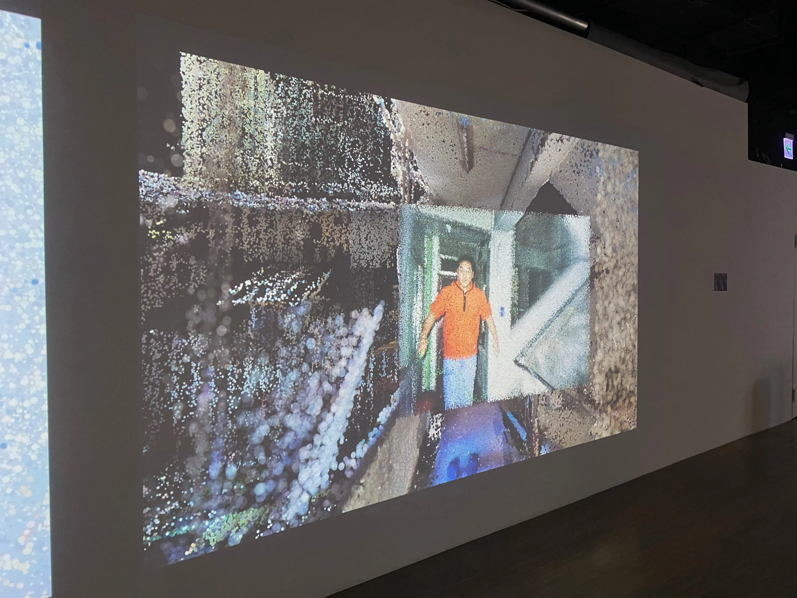
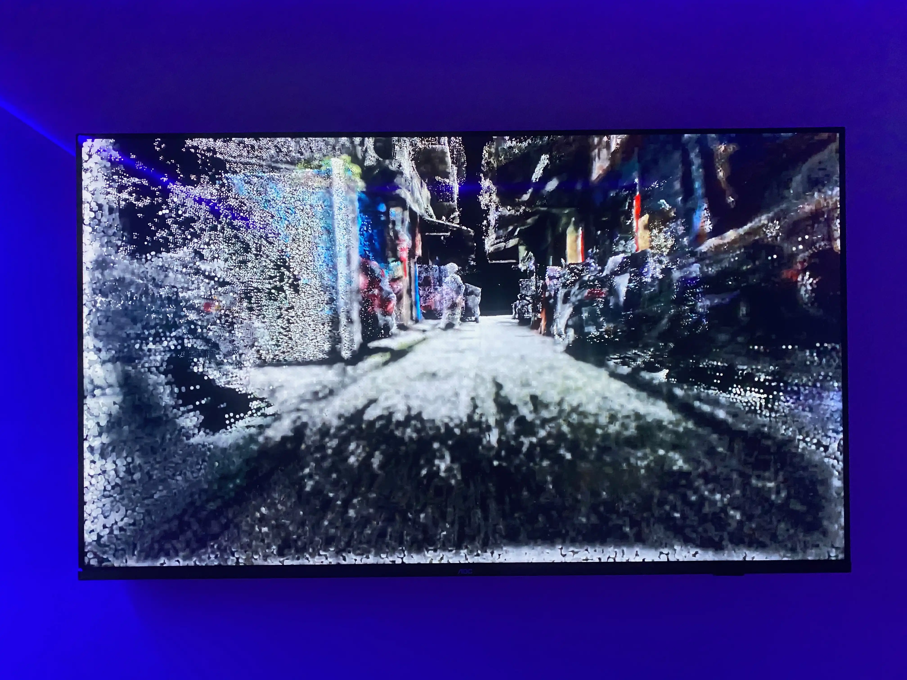
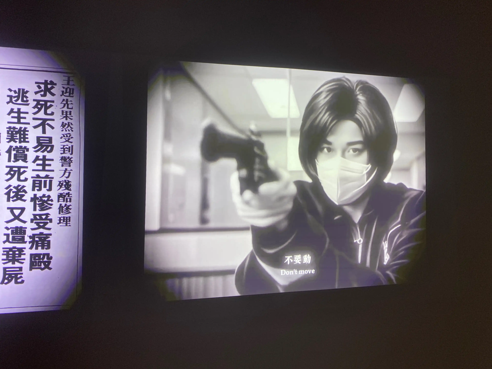
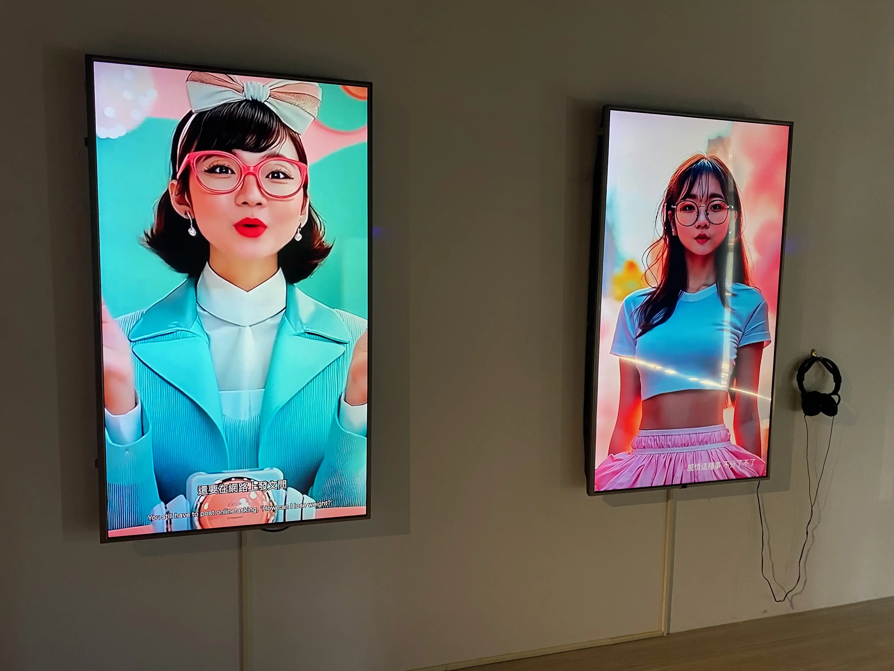

90年代以降，隨著數位技術的日趨成熟以及整合能力的提升，透過電腦數位後製，不同音像技術可以愈加方便地結合在同一個載體中。X光影像可以結合實際拍攝場景，空間的3D掃描點雲資料可以結合照片，影像可以藉由AI進行深偽（Deepfake）遊走在現實與虛構之間。然而，即便最後的成果都是數位影像，也享有共通的呈現介面（如投影機、LED螢幕等），這些不同技術生產出的影像，是否為我們帶來不同的技術知覺？

「渦流象限——國際動態媒體藝術展」（2025）由獨立策展人黃盟欽發起，並與西班牙馬德里放映機（PROYECTOR）錄像藝術節策展人 MARIO GUTIÉRREZ CRU 合作策畫動態媒體藝術特展，邀集國內外共23組創作者共同參與，於府中15展出。以參展者一員的角度試觀之，本次的參展作品展現了對影像技術的多元使用，並在技術特性的基底之上，開展各異其趣的知覺實驗與當代文化觀察。

### 表達與視野的調控——攝影機錄像

Maya Schweizer《錯誤的手勢》（Errant Gestures）蒐集了大量互不相關的人類行為片段並剪輯為特寫，有飾品攤販整理項鍊的手，人在街上步行的腳，理髮師的手部等。攝影機與剪輯的框選（framing），使得人在環境中的姿勢（posture）被去脈絡，手或腳成為介於有表達跟無表達之間的半—手勢（semi-gesture），框選這個動作也因此成為了一種表達。

作為表達之外，攝影機亦能呈現**視野的劇烈變換**，藉此想像非當下的體感與經驗。Marcela Cabutti《石頭的聲音》（El sonido de la Piedra）微觀拍攝巨石夾縫中，即將碎裂的小型黏土塊，並收錄其細碎的聲響，最後亦由空拍視角收尾，呈現在巨石上跳動的人群與巴爾卡塞移動石——擁有22億年歷史——及其周圍的景觀。許思婕《週期系列：何去何從》的7部影像皆由持攝影機者於不同地點，一邊行走一邊不斷朝前方360度甩動攝影機錄製而成。這為觀者帶來了一種詭異的行進知覺，在向前進的同時不斷回頭看，就像開車時不斷分神凝視後照鏡，亦帶來了一種眩暈的體感。

亦有一些作品將機器作為拍攝對象，呈現了**機器與人類的多樣關係**。林怡平+陳省聿的《居家符號學》（Semiotics of the Home）詼諧地以大型挖土機進行一系列居家行為，諸如換衣服、打蛋、滑手機拖延等，以物擬人；林沛瑤《心動》將人與電風扇並列在牆角的兩端，以冷硬的動作模擬電扇擺頭與吹氣等動作，以人擬物；Esther Weber《巨獸》（Big Monster）則將攝影機的框瞄準夜晚遊樂園裡的旋轉木馬，透過長快門曝光的攝影方式，以及現場收錄的尖叫聲，使其仿若使人們驚聲尖叫的巨獸，介於受人控制與控制人類之間。


IMG_7395.webp
IMG_7399.webp



IMG_7361.webp
IMG_7362.webp


### 模擬與想像——3D影像技術

與攝影機的在場性相比，我認為3D影像技術是更訴諸「想像」的一種技術，因為人類肉身迄今尚無法真正處於數位次元，我們僅能以共感的模擬能力，想像自己徜徉在元宇宙或異世界中。在練柏宏的《都是月亮惹的禍》中，虛擬世界宛若星座神秘學，難以真正觸及與驗證，如同3D建模的動畫世界，我們卻能與之共感進而受其影響。

若說3D建模距離我們的現實感較爲遙遠，3D掃描則立處於一個怪異的位置，夾處於現實與想像之間。機動研《陰極射線管秘境》與林旺廷《南機場琥珀計畫》皆使用了3D掃描並呈現其點雲（註1）資料，這些資料所再現的場景既來自現實世界，在資料的重構下，卻已經不同於我們能夠親身進入的那一個現實。一如已經消逝的台北市桂林路「電視巷」，與即將消失的南機場公寓，此技術對於場所與地方的「保存」（實則轉化），恰好在現實與想像之間的節點上，提供記憶一個憑弔的立足點。

### 混雜現實的超現實——AI生成影像

如同3D掃描，AI生成影像同樣處於現實經驗跟想像之間的曖昧位置，卻比前者混雜得多。AI從龐大的資料庫中學習、汲取所需，生成一個個似是而非、似非而是的影像元素，一個個可被辨認卻無從溯源的「似曾相識」。林雅暄《無聲的殺人告白》以搶銀行罪犯李師科和被誣告者王迎先的故事為文本，透過現場手槍裝置的互動方式，將觀者捲入這場社會事件的是非判斷之中，並以AI影像結合歷史照片，重建這些可能的歷史場景，諸如李師科搶銀行的現場，或者王迎先因遭逼共而自死明志的秀朗橋。郭佩奇《AI女孩》則以自身的形象與聲音為範本，提供AI訓練素材。右邊影像中的AI女孩有著藝術家的外貌與歌聲，詞曲創作者則是SunoAI（註2），哼唱與AI完美情人談戀愛的可能；左邊影像中的女孩則是一位AI藝術家，她以這樣的視角，戲謔地審視人類與AI，在創作、評論等藝術實踐上的差異。

兩件作品相較起來，《AI女孩》的人物影像相當完整，並且有一個明確的真實參照；即便仍能辨認出合成痕跡，然而已經足以使女孩的形象，模稜兩可地遊走在現實與虛擬之間；《無聲的殺人告白》則將AI影像的明顯破綻與不自然的細節作為作品的一部份，凸顯歷史事件的敘述本身亦可能具有虛構性質。

### 知覺象限的差異座標

如同材質的拼貼，各類技術都有其最為顯見的特性，除了凸顯其優勢並加以運用之，有時候將技術本身不常為人所見的暗面顯影，也是一種媒體藝術創作的進路。影像技術的原生差異，錨定了它們與現實（reality）的初始距離，但若刻意與此錨點的預設值對抗，產生認知上的反差，也能使原本親近現實的技術變得超現實，或使距離現實較遠的媒介產生現實感。一如展覽名稱「渦流象限」，透過分處不同知覺象限的各式影像作品，本展呈現了動態媒體在表達、現實、在場、想像等諸多端點之間，所共構的差異座標。

---

註1：點雲是指透過3D掃描器所取得之資料型式。 掃描資料以點的型式記錄，每一個點包含有三維座標，有些可能含有色彩資訊或物體反射面強度。資料來源：維基百科。

註2：SunoAI 是一個專注於音樂生成和文字轉音樂的先進 AI 平台。資料來源：SunoAI官方網站說明。