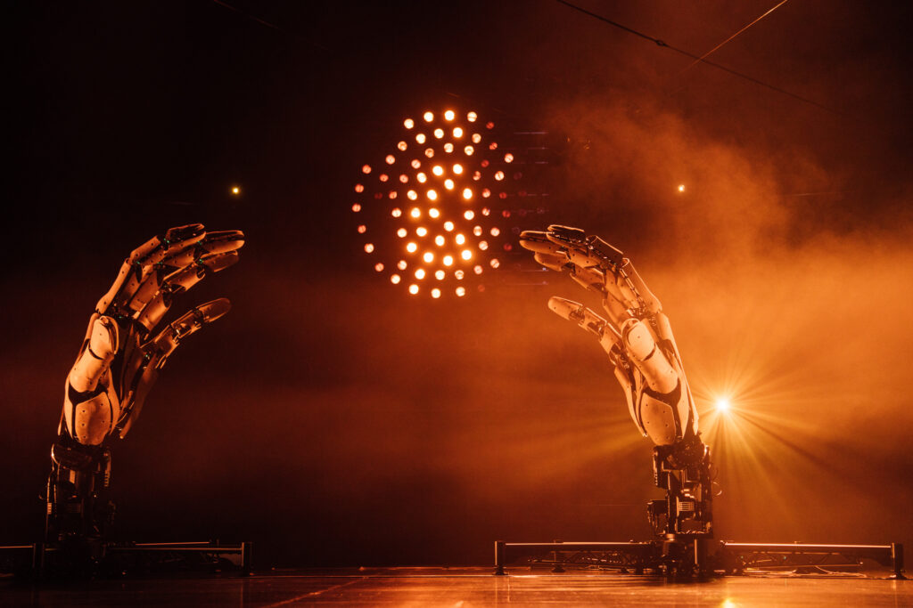
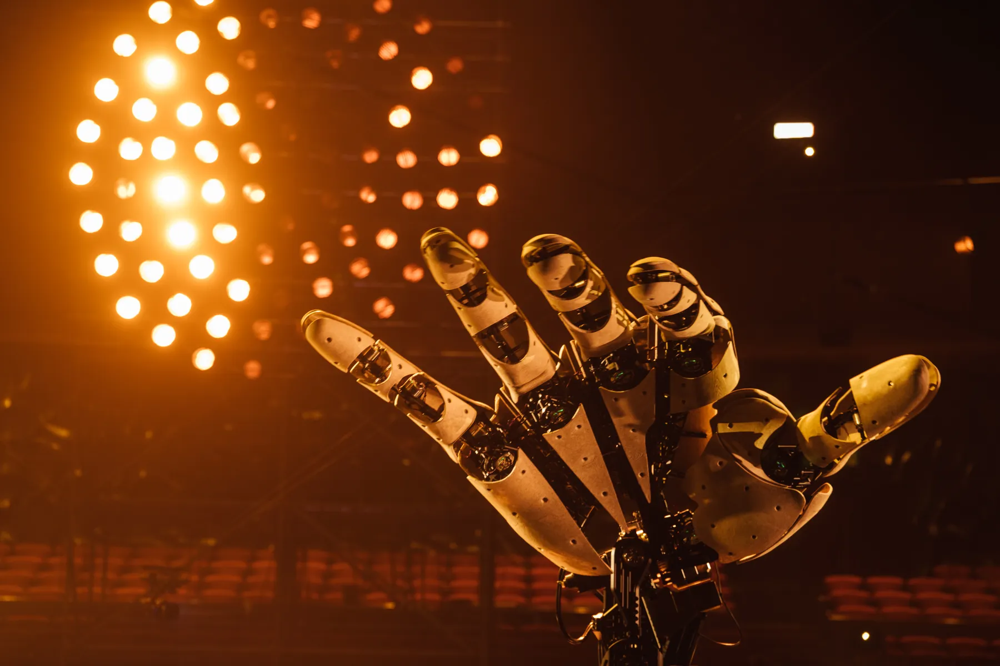
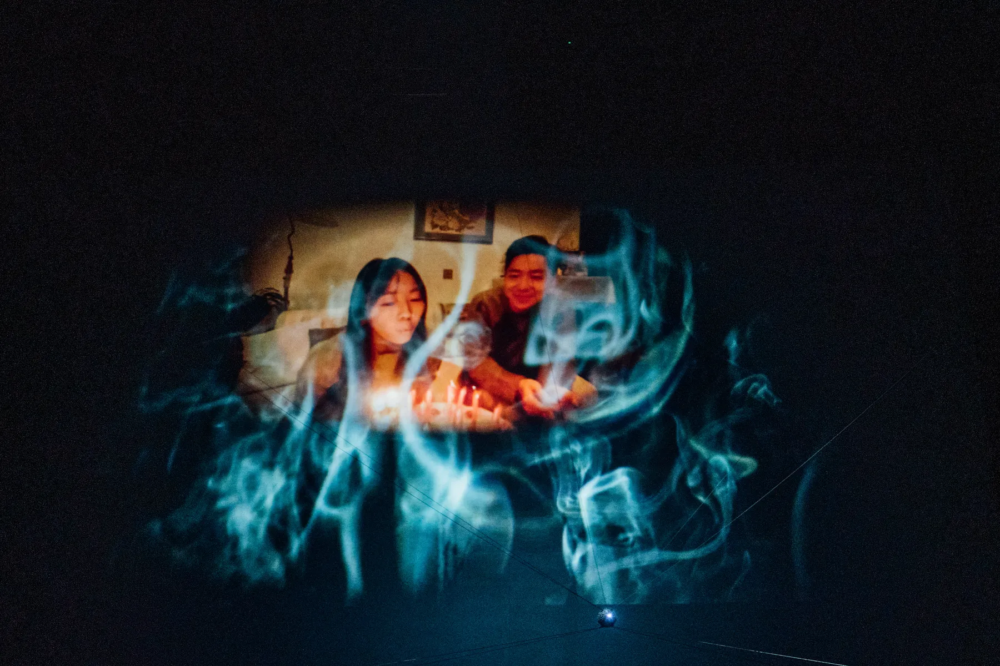
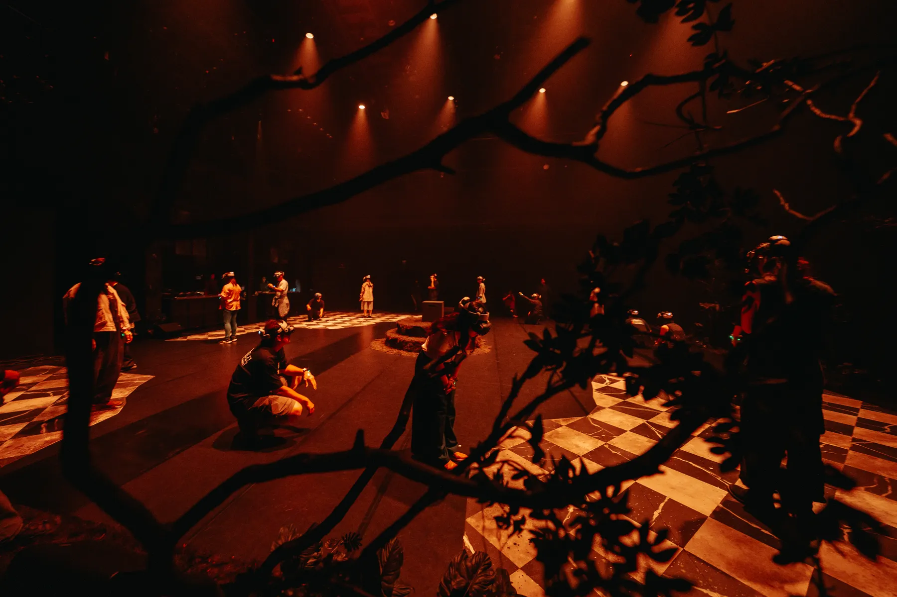
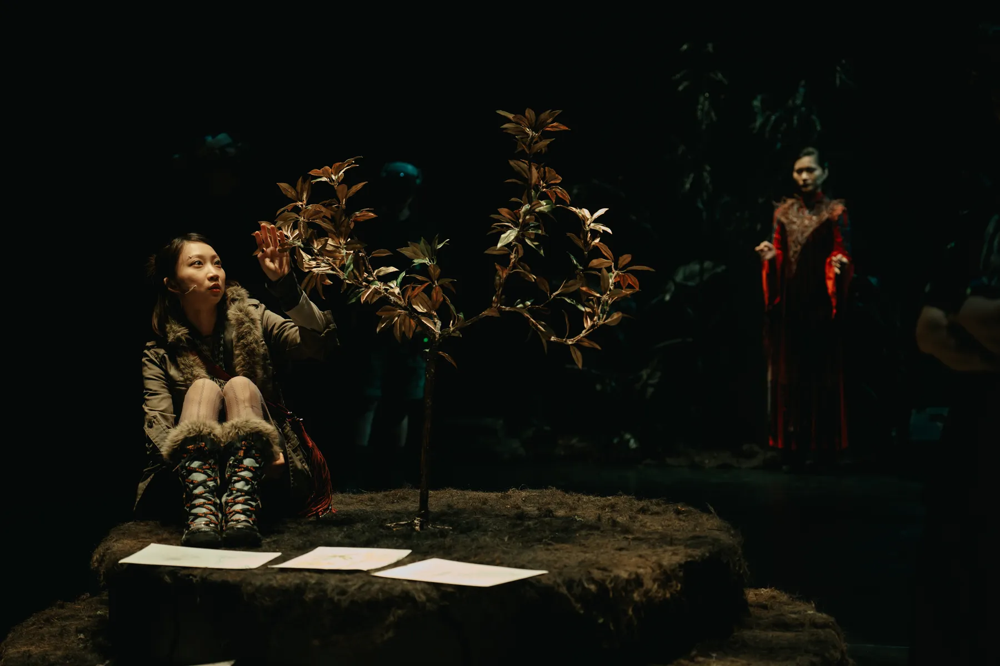
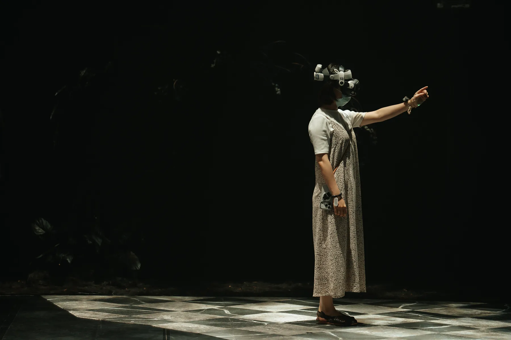

### 前言

近年來，結合科技媒體的非典型劇場體驗蓬勃發展，觀眾在演出中不再隱形，而是在不同程度上成為「角色」。許多作品隨即宣稱，這樣的編排能夠讓觀眾自由探索感知邊界，並透過不同的視角發展各異的詮釋。然在實際觀賞部分演出後，我感到這樣的「自由」，欲訴諸觀眾的體感經驗不流於形式，且在有限的演出時空內達到效果，實非易事。2026年豪華朗機工的無人劇場《最後一問》與僻室（House Peace）與在地實驗（ET@T）共製的延展實境劇場《獸靈之詩：頭骨的召喚》，即便有技術使用上的差異，兩者在「手」、「視角」等元素以及沉浸策略的安排上，似乎有著殊途同歸的目標：也就是讓觀者在演出中「佔有一席之地」，透過沉浸式的視角體驗演出。在本文中，我將以我作為觀眾的體驗出發比較兩檔演出，試圖探問並深究這些創作策略，如何嘗試將觀眾捲入演出結構中並將其化爲角色，又如何反映在觀眾的體感經驗上。

### 觀眾「共演」的舞台

「這是我的手！我以為我的手不見了。」女孩的聲音迴盪在舞台和觀眾席中。在豪華朗機工的劇場作品《最後一問》中，觀眾坐在舞台上，而台下的觀眾席空無一人，成為演出進行的背景。當布幕尚未升起，觀眾看著眼前的光球、投影、還有機械巨手的動作；而當布幕升起、燈光灑落，觀眾彷彿也成為了表演的一部份，在台上搬演的除了是藝術家編織的故事，也是觀眾各自的人生劇目。然而在觀演過程中，這個意圖的傳達似乎不斷遭受阻撓，讓作為觀眾的我感到格格不入：在每一個表現形式產生變化的當下，究竟面前的這雙手是誰的手？耳邊響起的聲音是誰的思緒？眼前所見又是誰的視野？觀眾究竟該作為旁觀的第三者，還是將自己代入角色的第一人稱視角，短暫成為敘事中的「我」？

進入《最後一問》的表演從觀眾在安全門前排隊等待入場開始，而進場後看到的座位並非熟悉的大劇院。臨時搭建的階梯式觀眾席（以下簡稱「階梯席」）設置在舞台上，觀眾面朝原本的觀眾席隨機入座，此時布幕尚未升起。在演出正式開始前，微弱的黃光照在階梯席上，舞台中央則一片漆黑。觀眾難以看清舞台上的機械，只隱約聽見機器運作的嗡嗡鳴聲，以及看見那一顆即將作為敘述者替身的機械小光球。黃光熄滅後，演出開始，舞台中央的小光球先行亮起，兩道投影紗先後降下於階梯席前的舞台上，開啟了主線敘事。此時舞台布幕仍未升起，觀眾尚未能看見台下的觀眾席。

首先映入眼簾的是第一層投影幕上兒童塗鴉的動畫，女孩的聲音敘述著自己與父親互動的童年片段。隨後，畫面跳到了第二層投影幕，語音敘述也從女兒的畫外音，變化為影像內的父女對話，呈現了父親跟女兒的互動，還有女兒長大後坐在書桌前，獨自憶起父親的情景。當這些零散的片段結束時，人物的動作會定格，而影像空間則彷彿突然被賦予了三維向度，鏡頭被往後拉遠俯視著人物。此時觀眾彷彿能想像，這位父親或許已經離開這個世界。

此時，投影紗與舞台布幕升起，觀眾直接看見那雙巨大機械手矗立在觀眾席之前，將空無一人的紅色座椅化為背景。接著，耳邊響起了與先前敘事風格迥異，情緒飽滿濃烈的音樂，那種斷然決裂的感受，幾乎像突然開始看另一場電影。當女孩的聲音說道：「這是我的手！我以為我的手不見了。」作為觀眾的我不禁又猜想，難道這其實是女兒的臨終時刻？在這關鍵一瞬前，她回憶起過去與父親的往事；之後，她則來到了父親的世界、靈魂的世界。這雙大手開始有了動作，跟隨音樂的節奏抓握、伸展、擺動；而階梯席上的觀眾則彷彿佔據了大手主人的位置，同時想像自己是敘事中的女兒與舞台上的小光球。在整個演出的過程中，第一顆小光球在舞台空間中凌空遊走，它的外殼是由多個光點構成，除了光點自身發亮，光源亦可以從球的内部往外照射，產生具有城市結構般的影子。隨著演出進行，台下觀眾席上方的另一顆小光球也隨後現身，兩顆球交互亮起並在空中移動，像在人生這場戲中對話並走位著。

### 「我」在哪裡？

這個舞台試著告訴觀眾：他們既是別人人生的觀眾，同時也是自己人生的表演者。這雙大手主人的視角為觀眾所佔據，而以軌道和鋼索移動、徘徊在舞台各處的光點，則彷彿是聲音主人的意識體。從親子的回憶、生死之別到對生命哲學的思考，演出似乎鼓勵觀眾以自身的經驗代入敘事中的女兒視角。在沒有任何實體演員，只有語音臨場的舞臺上，觀眾既可以是第一人稱的「我」，也可以是第二人稱的「你」；當女兒的聲音問「我在哪裡？」而父親的聲音回答「你在你的問題裡」時，觀眾不僅覺得他是在跟女兒講話，同時也覺得他在對自己說話。對我而言，這亦是《最後一問》劇場空間配置巧思的最大潛能，意即使「敘事沉浸」與「身體沉浸」的主體產生交會。「敘事沉浸」意圖帶領觀者進入虛構的世界，引誘你忘卻當下的在場，成為可以任意附身角色的觀看者，如鬼魂一般隨著敘事進出角色心境，並「代入」角色的知覺裡；而「身體沉浸」則希望觀者將自身的在場「帶入」情境之中，在自身眼光之上疊合情境所套加的濾鏡，引導觀眾觀察自身與作品環境之間的關係，並自然而然地成為情境中角色的一員。

這兩種沉浸策略並非無法共存，而其交會之處即在於觀眾的角色扮演。若以適當的角色設定作為中介，觀眾在代入敘事中角色心境的同時，也能夠保持與作品環境的互動，不會感到自身的在場與環境格格不入。然而在《最後一問》中，創作者希望觀眾能夠穿梭其間的幾種角色心境或設定——一是「代入」敘事中的父親與女兒，二是將觀眾自身「帶入」舞台，作為象徵上的表演者一員——既無法好好地合作，觀眾亦無法在角色間順利轉換。我認為這是本來一向擅長身體沉浸的豪華朗機工，在將場域自展場轉換至劇場時，自行捆綁了手腳。劇場的「演出時間」成為了害怕內容不足的限制，而非推進作品呈現進化的契機。

在豪華朗機工過往的作品中，觀眾多半是作為「自己」進到他們打造的場域，並觀察自身的感知變化。如其自述的創作核心，豪華朗機工希望「提供一個時間和空間，讓觀眾在裡面找到屬於自己的視角，創造能把觀眾包含進去的體驗。」[^2引用自「宇宙寫生—豪華朗機工個展」藝術獎訪談]，台新銀行文化藝術基金會。] 我認為其作品的強項，是讓觀者的身體在作品周圍自由走動，找尋作品所暗示的最佳觀看位置，並且不預設觀者的停留時間。這樣的優勢進到劇場，卻被固定座位的觀眾席和固定演出時長限制住。他們提供了身體沉浸的條件，讓觀眾走上舞台成為演出的一部份，同時想要引導觀眾與敘事角色共情，加入了父親和女兒兩位角色，使觀眾需要暫時代入他們其中之一（有時甚至同時）的視角。然而，《最後一問》的敘事並不如連續劇與電影一般，足以支持我們暫時「成為別人」或「遺忘自身」：觀眾所聽所見的，是與日常經驗斷裂的不自然語句，以及稍嫌刻板印象化的家庭回憶影像，直白地像過於溫情的廣告片。由於角色並不立體，這些敘事並沒有為觀者創造足以代入角色心境的空間，若非自身的相關經驗被召喚，觀眾很可能會無動於衷。後半段一味地用音樂渲染悲傷的情緒，似乎也透露出創作者對於敘事過於單薄的不安。

回顧其甫獲台新藝術獎的大型個展《宇宙寫生》（2025）[[2]](https://onscreentoday.com/view-zh/whose-hand-is-this-narrative-perspective-and-the-audiences-body-in-immersive-theater-strategies-zh/#note2)，我們或許可以將作品〈很難很難〉（2019）視為《最後一問》整個劇場舞台的微縮模型。在〈很難很難〉的裝置中，我們自由地在城市模型外圍走動、觀看，而穿梭其間的小光球維持了相對單純的角色：一個能讓任何觀者投射的小小意識體，可能是對童年的回首，又或者是逝者靈魂的回訪，端看觀者如何詮釋與感知。然而，《最後一問》的劇場演出在這之外，又爲這個小光球——觀眾原本可以自由進出的位置——添加了女兒對父親的回憶，使觀眾不得不將光球解讀為女兒或者父親，將視角依附在創作者的角色設定上。

我也許可以用另一種觀點來為作品辯護：或許《最後一問》從未試圖讓觀眾進入「敘事沉浸」，從頭到尾只是希望觀眾作為演出的一部份，以旁觀者的視角看待父親和女兒的敘事。這其實很有可能是創作者的方向設定，但也因此，創作者忽略一旦將觀眾從可以將自己隱身的傳統觀眾席帶上舞台，將自己認知為表演的一部份，同時又望向同在舞台上的這雙大手，透過這個視角將大手視為自己的延伸；此後，又再聽到女兒的聲音說「這是我的手！」，觀眾的角色與女兒的角色在這個暗示中不可避免地重疊了。因此，這兩個角色之間或轉換或重合的關係，勢必需要更細緻的調和，或擇其中一種再將其單純化。

### 佔有一席之地：視角、聲音與在場的存在感

反觀僻室《獸靈之詩：頭骨的召喚》（以下簡稱《獸靈之詩》），在一開始就明確賦予了觀眾特定的角色——向模仿師學習「模仿」的學徒——並界定了「模仿」的意義：透過模仿他人，觀眾可以看到他人眼中的世界。這場改編演出對小說敘事設定的運用，巧妙地讓「敘事」與「身體」兩種沉浸策略互相合作。即便觀眾的視角切換在自身（VR的穿透模式）、模仿師璐安與哥哥泰邦（VR虛擬視野）之間，因為「模仿」這層概念中介與「透過頭顯獲得虛擬視野」的技術中介完美結合，觀眾感到自己的在場是合理的。並且，雖然觀眾被賦予了角色，卻不會被迫背負過多的角色設定和互動任務。相較《最後一問》，《獸靈之詩》雖然使用 XR 技術，更加全面地包覆、控制了觀眾的視野，卻反而為觀眾保留了更多抽離開角色心境的心理自由空間。我甚至認為，《獸靈之詩》比《最後一問》更加深刻地直面了「這是誰的手／誰的視野？」的問題，並將其靈活地化用於媒介與形式之中，而非透過語言直接向觀眾丟擲。

在輪流配帶互動手環與 VR 頭戴顯示器（後簡稱頭顯）後，十來位觀眾先在空間中隨意地遊走。透過頭顯的穿透模式，劇場的實體空間經由頭顯上的攝影機，在觀眾的視野中再現，並疊合了 3D 動畫成為混合實境，而觀眾可以跟這些動畫互動，練習模仿術「創煉」。隨著演員「模仿師璐安」的登場，觀眾被定義為模仿師的學徒，並因為「模仿」而能夠看見被模仿者的視野；緊接著，觀眾模仿璐安的視野，跟著他來到了由動畫打造的虛擬實境「影世界」。雖然身上背負了角色，作為觀眾的我仍覺得是「我」在探索這個空間，而璐安只是陪同我來到這個世界，一邊指引我、一邊告訴我他們的故事；同時，我卻也可以偶爾將自己與璐安共情，想像璐安正看著跟我一模一樣的畫面。

模仿師學徒的角色設定，爲視野的轉換提供順暢的心理轉場。在觀眾來到巫女的所在地後，頭顯切換為混合實境，觀眾的視野回到當下的劇場，看見了本來只透過聲音臨場的巫女，而璐安的身體也回到了觀眾的視野之中。所有的觀眾都站在環形走廊中，望向中庭的兩位演員。那些廢墟中的白色欄杆以及叢生的藤蔓都是動畫，而兩位真實的演員卻透過頭顯的攝影機，佇立在虛擬的場景之中。演員的肉身在場，不僅讓我們獲得了同時存在於劇場空間與虛擬空間的座標，也讓我們感到這兩個世界——《獸靈之詩》原著中構建的「原世界」與「影世界」——之間，是相互連結而一體兩面的。

即便當代的互動已大量依賴遠端通訊，我們不得不承認，他人的在場與否，對個體而言有著巨大的差異。即便觀眾無法看見或聽見他——或許他身在黑暗中，或許觀眾的視野暫時被蒙蔽——只要你「知道」有一個人正在你身旁，跟你共處同一空間，就足以改變你感受這個環境的方式。在《獸靈之詩》的其中一個場景，觀眾透過模仿師璐安的記憶，來到哥哥失蹤的前一晚，以他的視角重遊他跟哥哥泰邦的家。當璐安的聲音在觀眾耳邊喃喃訴說著回憶，忽然間，巫女一邊吟唱著祭歌，一邊輕輕地從我身後走過；我看不見她，卻感受到她的存在，感受到她走進又走遠的腳步聲、漸強又漸弱的歌聲，感受到她的身體輕輕地帶動了風；而當那陣風拂過我背後的衣裳，我倏地想起，我正觀看的並不是當下，而是過去所發生的事。

這樣不惜重本地洽請演員，在有大量 3D 虛擬場景的延展實境劇場中現場演出，確實有其無可取代的意義。《獸靈之詩》即便有兩位演員在現場演出，他們實際亮相的時間卻不多；不如說，他們有大半時間是以他們身體的存在感以及聲音，在這場演出中與觀眾「共存」，而非現身在觀眾面前。相較之下，《最後一問》雖然在宣傳中強調其為「沒有演員說台詞」的「無人劇場」[[3]](https://onscreentoday.com/view-zh/whose-hand-is-this-narrative-perspective-and-the-audiences-body-in-immersive-theater-strategies-zh/#note3)，預錄的語音敘事實際上佔比不少，但觀眾並不會因為聽到這些語音，就認為這對父女的靈魂跟觀眾共存於這個空間。意圖透過「聲音／語音」創造說話者的臨場感，我想並不僅僅是聲學效果逼真與否的問題，還需要作品為觀眾鋪陳的心理認知為基礎——不論是在《獸靈》中觀眾對演員在場的意識，或者觀賞恐怖片後讓人不禁開始相信的超現實存在——才能打造仿若說話者「在場」的效果。

### 「手」作為中介

即便都是以視聽效果為主的劇場作品，「手」在這兩部作品中共同作為一個重要元素。《最後一問》在視覺上將機械大手、舞台配置與觀眾視角結合，而《獸靈之詩》在視角投射之外，還加以運用了手的觸覺與操作性。乍看之下，觀眾的手似乎並非《獸靈之詩》敘事進行的必要元素；它們既不像眼睛接收虛擬世界的空間資訊，不需像耳朵聆聽話語、聲響和音樂，不像雙腿需負責在空間中移動，整體敘事也並未因我們用手比劃的「模仿術」而產生實質改變。既然如此，觀眾的手與相關的互動設計，到底激發了什麼樣的身體感知？

對我來說，即便《獸靈之詩》中「模仿」與延展實境技術之間，概念與媒介的整合已經足夠完整，「手」仍然扮演了一個畫龍點睛、強化兩者之間關聯性的中介。頭顯上的攝影機能辨識我們的手勢，並在虛擬世界中同步再現，或為璐安有著黑色指甲、或為泰邦帶著傷痕的雙手；時不時，觀眾也被提示可以提起房間中的油燈，或者蹲下撫摸雲豹。觀眾之所以能投入「因為模仿、所以看見」這個設定之中，很大程度就是因為，在創作團隊相當克制的互動提示引導下，「手」作為觀眾在虛擬世界中唯一可見的自身存在證明，銜接了虛擬與現實的共時，並使觀眾產生參與在其中的感受；與此同時，在視角轉換中，觀眾的手仍能夠自由動作的事實，也確認了觀眾在作品中的角色只是模仿師的學徒，而不是模仿師本人，因此觀眾並不感到自己「需要」代入角色心境以投入故事之中——即便仍能與其共感，就像我們每個人在生活中與他人共感一樣。

只有經由鏡子、攝影機等媒介的中介，我們才能看見自己的臉；相比之下，我們幾乎每時每刻都能看見自己的手，看著它們如何與所處的環境互動。看向自己的手，是我們確認自身握有參與和介入環境的能力，分辨此刻正處於現實而非夢境之中的習慣動作。以我自身為例，在夢境中，甚少記得有我的雙手出現在視野中的畫面，讓我時常感到夢境中的那個我，並不受「我」的掌控。許多影視作品中，也時常以攝影機呈現角色以第一人稱視角，觀看其手部並試著抓握的畫面，以描寫其從夢境甚至昏迷中醒來時，嘗試辨別自己是否清醒。回到《最後一問》，我認為其中機械大手的動態，其實就是以視覺意象的方式，將「手」隱喻為自我與世界之間的中介。然而隱喻能理解歸理解，又如何能夠直接連結到觀眾的身體感知？若藉《獸靈之詩》來對照，我不禁想像「觀眾的手」在其中，能夠扮演什麼樣的角色，又具有什麼樣與這雙大手「互動」的可能性。

---
### 關於「第一人稱複數」

「第一人稱複數：觀眾作為隱藏版角色」系列書寫計劃由林沛瑤發起，從其作為創作者、研究者與觀者的三重視角出發，面對愈發強調即時互動的數位技術環境，探討廣義的「互動性」如何透過觀者的在場經驗，在當代藝術展演中發生。本計畫觀察對象橫跨臺灣藝術場景中的媒體藝術、劇場、沈浸式展演等時基藝術（time-based）作品，透過探索其中的互動情境、感知部署、表演性與觀演關係，以評論觀察為方法，發展「互動的現象學」系列研究，並獲2026年國藝會「現象書寫－視覺藝評專案」贊助支持。

* 活動共同企劃 & 第一讀者｜楊智翔（Wave Yang）
* 贊助單位｜財團法人國家文化藝術基金會、文心藝術基金會
* 本文 2026年9月首刊於[《SCREEN 介面》](https://onscreentoday.com/view-zh/whose-hand-is-this-narrative-perspective-and-the-audiences-body-in-immersive-theater-strategies-zh/)（編輯：徐詩雨）